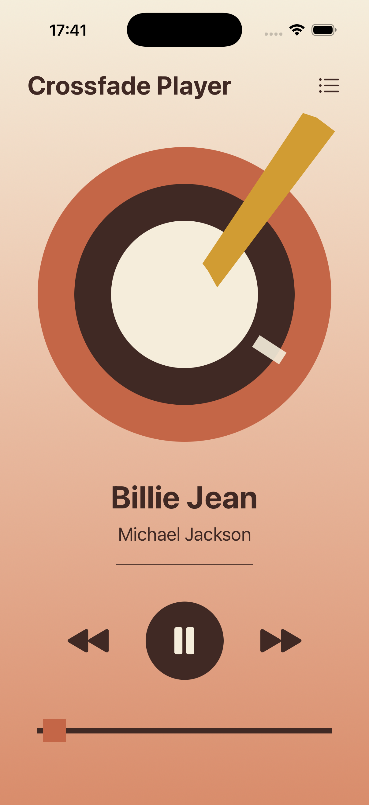
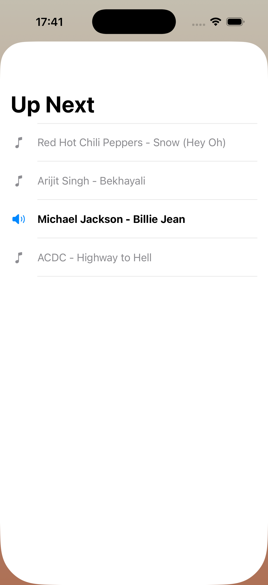
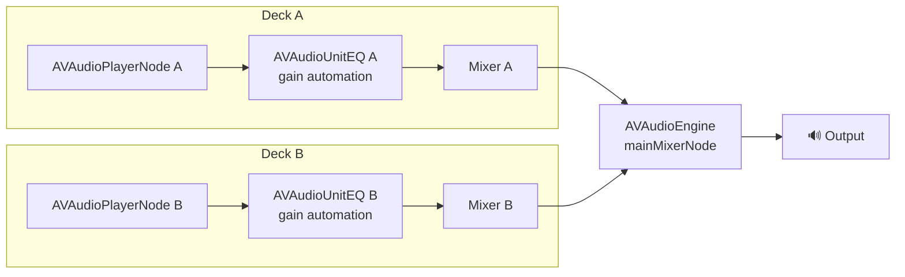

# 🎧 CrossFadeMusicPlayer

A native iOS music player, built with SwiftUI and `AVAudioEngine`, that crossfades seamlessly between local lossless (FLAC) tracks — the kind of gapless, overlapping transition you'd get from Spotify or a DJ mixer, running entirely on-device against your own audio files.

Think of it as a love letter to `AVAudioEngine`: two player "decks" secretly swapping places behind a spinning vinyl record, sample-accurate handoffs, and a UI that never has to guess what the audio thread is doing.

> Built as a proof of concept to dig into low-level iOS audio scheduling — not a shipped product, but hopefully a fun one to read through.

## See it in action

<table>
<tr>
<th>Main Player</th>
<th>Queue View</th>
</tr>
<tr>
<td></td>
<td></td>
</tr>
</table>

**Crossfade in action:**

<video src="https://raw.githubusercontent.com/Darshan-D/Harmoniq/main/docs/media/crossfade-demo.mov" width="280" controls muted loop>
  Your browser/viewer doesn't support inline video — open docs/media/crossfade-demo.mov directly.
</video>

<!-- 📸 Screenshots/recording pending — drop them into docs/media/ as:
     player-view.png, queue-view.png, crossfade-demo.mov -->

## What it does

- 🎵 Plays a local queue of tracks with play/pause, skip, a smart "previous or restart", and an interactive seek bar.
- 🔀 Automatically crossfades into the next track during the final 5 seconds of the current one — no gap, no hard cut.
- 💾 Streams audio straight from disk (`AVAudioFile` + `scheduleFile`) rather than loading whole files into memory, so the memory footprint stays small even with large lossless files.
- 📞 Reacts to phone calls and headphone disconnects by pausing playback automatically.
- 💿 Drives a little vinyl-record UI (tonearm lift, disc flip) choreographed to the crossfade itself, just because it's fun to watch.

## Architecture

The engine uses a "dual-deck" node graph — one deck plays while the other quietly preloads the next track, then they swap:



- **`CrossfadeAudioEngine`** owns the node graph and all playback state. Every piece of mutable state (which deck is active, the current track index, file handles, the crossfade trigger flag) is only ever touched on one serial `DispatchQueue` — user actions from the UI, the polling timer, and track-completion callbacks all funnel through it, so there's no locking and no data races between threads.
- **`AudioPlayerViewModel`** wraps the engine, re-publishes its state on the main thread via Combine, and exposes user intents (`togglePlayPause`, `skipToNext`, `goToPreviousOrRestart`, `seek`) to the UI.
- **`MinimalistMusicPlayerView`** / **`QueueView`** are the SwiftUI screens — the player itself and the "up next" queue sheet.

### How the crossfade actually works

1. A background timer polls the active deck's `AVAudioPlayerNode` ~20 times a second to track playback position.
2. Once the active track has 5 seconds left, the standby deck (already preloaded with the next track) quietly starts playing *underneath* it.
3. Both decks' `AVAudioUnitEQ` nodes ramp their `globalGain` in opposite directions over those 5 seconds — the outgoing track fades to silence, the incoming track fades in — so the two overlap instead of cutting.
4. When the outgoing track finishes, the decks swap roles and the new standby deck preloads the track after next.

Skipping or seeking past the crossfade window instead does a hard cut (stop one deck, play the other from the target frame) — no fade math needed there.

## Project structure

```
CrossFadeMusicPlayer/
└── CrossFadeMusicPlayer/
    ├── AudioEngine/
    │   └── CrossfadeAudioEngine.swift   — AVAudioEngine node graph, crossfade & thread-safety logic
    ├── ViewModel/
    │   └── AudioPlayerViewModel.swift   — Combine bridge between the engine and SwiftUI
    ├── Views/
    │   ├── MinimalistMusicPlayerView.swift
    │   └── QueueView.swift
    └── Songs/                           — local audio files bundled into the app
```

## Running it

1. Open `CrossFadeMusicPlayer/CrossFadeMusicPlayer.xcodeproj` in Xcode.
2. Select a simulator or device and hit Run.
3. The app looks for tracks by exact filename (FLAC, then MP3, then WAV) in `Songs/`, matching the list in `AudioPlayerViewModel.loadSongsFromBundle()`. Swap in your own audio files there (and update that list) to try it with different music — just make sure each file is added to the app target's "Copy Bundle Resources" build phase.

## Scope & limitations

This is a proof of concept, not a production music player:

- The track list is a hardcoded array, not a dynamic library.
- No persistence (queue position, playback state) across launches.
- No app icon yet.
- Crossfade duration (5s) and the overlap trigger are fixed constants, not user-configurable.

## License

MIT — see [LICENSE](LICENSE).
